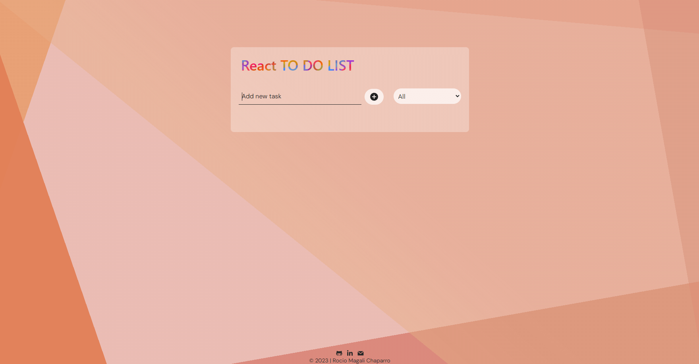
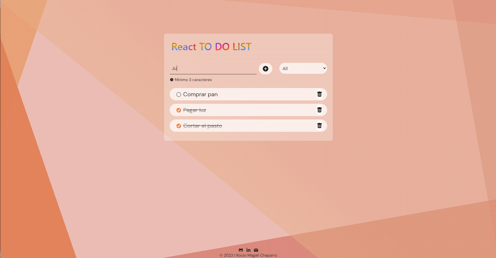
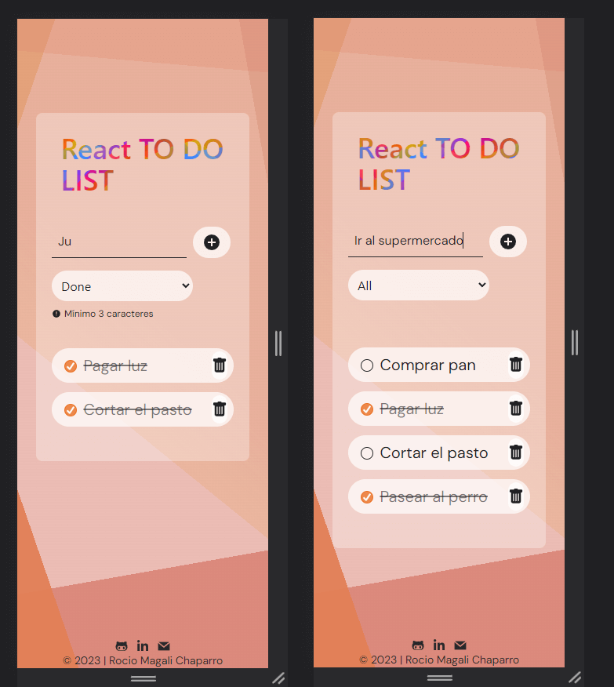

# Proyecto To do list con React & Vite

Me llamo Rocío Magalí Chaparro, tengo 31 años, soy de La Plata y estoy estudiando para convertirme en desarrolladora Frontend Developer. En esta ocasión les presento el primer proyecto del primer módulo de ReactJs en Ada ITW.
***

## Índice

- [Descripción del proyecto](#Descripción-del-proyecto)
- [Herramientas utilizadas](#Herramientas-utilizadas)
- [Ver el proyecto](#ver-el-proyecto)
- [Desarrolladores](#desarrolladores)
- [Contacto](#contacto)

***

### Descripción del proyecto

Con 'To-Do List' podras agregar fácilmente nuevas tareas, marcarlas como completas o incompletas, y eliminarlas según tus necesidades.
Una de las características clave de esta aplicación es que utiliza el almacenamiento local para que puedas mantener un seguimiento constante de tus tareas. Esto significa que si la aplicación se cierra tus tareas seguirán estando disponibles y actualizadas.
La interfaz de usuario intuitiva y fluida te permite filtrar tus tareas por estado: completas, incompletas o ver todas. Esto facilita la visualización y gestión de tus tareas según su progreso. Es totalmente adaptativa, gracias al uso de media queries.
Este proyecto está realizado con Vite y ReactJs. Vite es un entorno de desarrollo ultrarrápido para aplicaciones web permitiendo tiempos de inicio y recarga extremadamente rápidos al aprovechar la carga en tiempo real.
React.js es una biblioteca de JavaScript de código abierto, su característica principal es su enfoque en la creación de componentes. Los componentes son bloques de construcción reutilizables que encapsulan la lógica y la interfaz de usuario de una parte específica de una aplicación. Esto facilita la creación y el mantenimiento de aplicaciones complejas al dividir la interfaz en partes más pequeñas y manejables.

***

### Herramientas utilizadas
- HTML5
- CSS3
- Git
- Github
- Vite
- ReactJs
- React Icons
- Tailwind
***

### Ver el proyecto
Para poder visualizar el proyecto simplemente colocá el siguiente enlace en tu navegador preferido:

https://react-to-do-list-silk.vercel.app/

Preview del proyecto:

Version desktop

Version mobile

### Desarrolladores

- Rocío Magalí Chaparro

***
### Contacto
Si te gustó mi proyecto y te interesa mi trabajo, podes contactarme a cualquiera de mis redes sociales.

- Github: <a href="https://github.com/Rocio-Ch" name="github">Rocío-Ch</a> 
- Mail: <a href="mailto:rociomagali77@gmail.com" name="mail">rociomagali77@gmail.com</a>
- Linkedin: <a href="https://www.linkedin.com/in/roc%C3%ADo-magal%C3%AD-chaparro-a3530a239/" name="linkedIn">Rocío Magalí Chaparro</a>